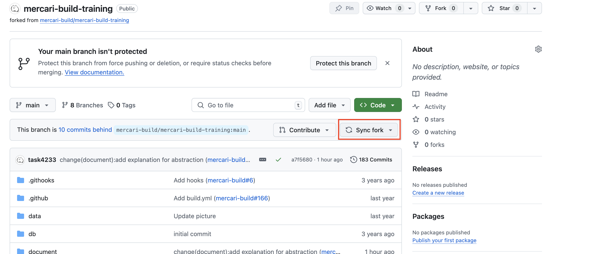

# STEP1: Git

このステップではGitとGitHubの使い方を学びます。

**:book: Reference**

* (JA)[Gitを使ったバージョン管理](https://backlog.com/ja/git-tutorial/intro/01/)
* (JA)[Udemy Business - Git：はじめてのGitとGitHub](https://mercari.udemy.com/course/intro_git/)
* (EN)[Git basics](https://www.atlassian.com/git)
* (EN)[Udemy Business - GitHub Ultimate: Master Git and GitHub - Beginner to Expert](https://mercari.udemy.com/course/github-ultimate/)

## **mercari-build-training** リポジトリをフォークする

* [mercari-build-training](https://github.com/mercari-build/mercari-build-training)
  をあなたのGitHubにForkします。
* Forkに成功すると `https://github.com/<your github id>/mercari-build-training`
  というようなリポジトリができます。

## Gitをインストールする
1. Gitをご自身のPCにインストールしてください。以下のコマンドが動けばOKです。
   ```shell
   $ git version
   ```

   * Macを使っている場合: [brew](https://brew.sh/index_ja) をインストールしてから `brew install git`を実行
   * For Windows user: Download [installer](https://gitforwindows.org/)

2. git configに自分の名前とemailアドレスを設定します。以下のコマンドを実行して最後にあなたのemailアドレスが表示されればOKです。
   ```shell
   $ git config --global user.name "<your name>"
   $ git config --global user.email "<your-email-address>"
   $ git config user.email
   <your-email-address>
   ```
   
## Gitの基本コマンドを使う

1. `https://github.com/<your github id>/mercari-build-training` を **clone**
   します。 cloneすると、github上のリポジトリを自分のローカルにDownloadできます。
   ```shell
   $ cd <your working space>
   $ git clone https://github.com/<your github id>/mercari-build-training
   ```

**:bangbang: 注意**

cloneができたら必ず以下のコマンドを実行してください。
```shell
$ cd mercari-build-training
$ git config --local core.hooksPath .githooks/ 
```
これは mercari-build-training が githooks という機能を使うために必要なものです。

2. `first-pull-request`というブランチを作り、そのブランチに**switch**します
   ```shell
   $ cd <your working space>/mercari-build-training
   $ git branch first-pull-request
   $ git switch first-pull-request
   ```
3. README.md の中にある`@your_github_id` の部分をあなたのgithub idに書き換えてください
4. 書き換えた内容を **commit**します
   ```shell
   $ git status # Check your change
   $ git add README.md # README.mdの変更をcommit対象にする
   $ git commit -m "Update github id" # どんな変更を加えたのかを伝えるコメント
   ```
5. 変更内容をgithubに**push**します
   ```shell
   $ git push origin first-pull-request:first-pull-request
   ```
6. `https://github.com/<your github id>/mercari-build-training`を開き、**Pull Request**(PR)を作ります。
    - base repository: `<your github id>/mercari-build-training`
    - base branch: `main`
    - target branch: `first-pull-request`

## PRのレビューをする、PRのレビューをもらう
- PRができたら、チームメイトにそのPRのURLを見てもらいます
- 1人以上に`approve`をもらえたらそのPRをmainブランチにmergeします
- また、チームメイトのPRを開いて **変更内容を確認**し、`approve` しましょう。

---

**:book: Reference**
- [コードレビューの仕方](https://fujiharuka.github.io/google-eng-practices-ja/ja/review/reviewer/)

**:beginner: Point**

以下のキーワードについて理解できているか確認しましょう。

- branch
- commit
- add
- pull, push
- Pull Request

---

## 最新の変更をpullする

fork元のリポジトリが更新された場合、その変更をforkした自分のリポジトリにも取り込む必要があります。

1. forkしたリポジトリの状態を更新する

`https://github.com/<your github id>/mercari-build-training` をブラウザで開き、以下の通りforkしたリポジトリを更新してください。




2. ローカルの状態を更新する

```bash
git fetch origin
git merge origin/main
```

### Next

[STEP2: 環境構築](02-local-env.ja.md)